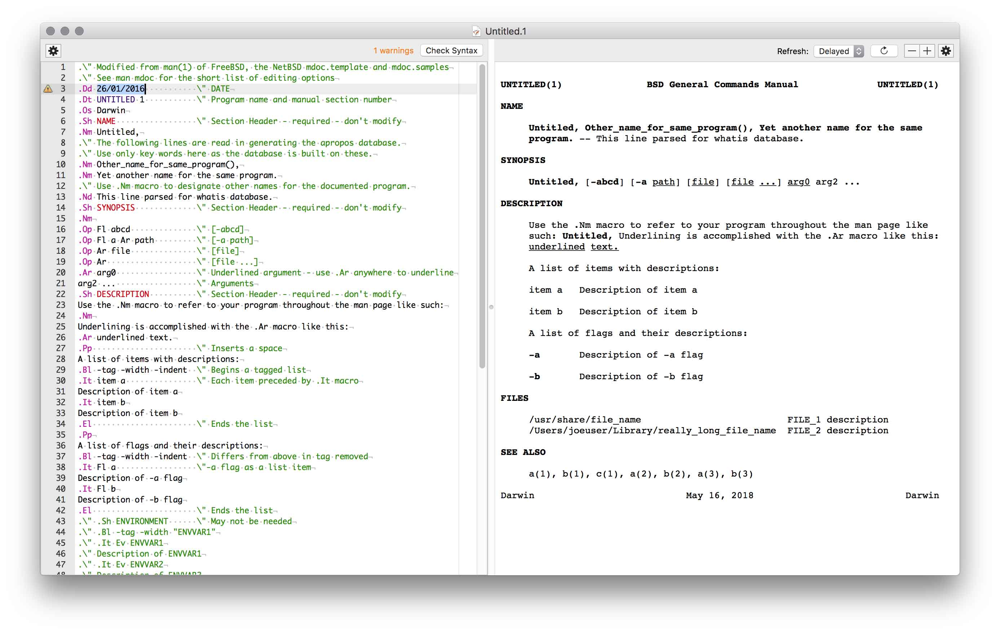
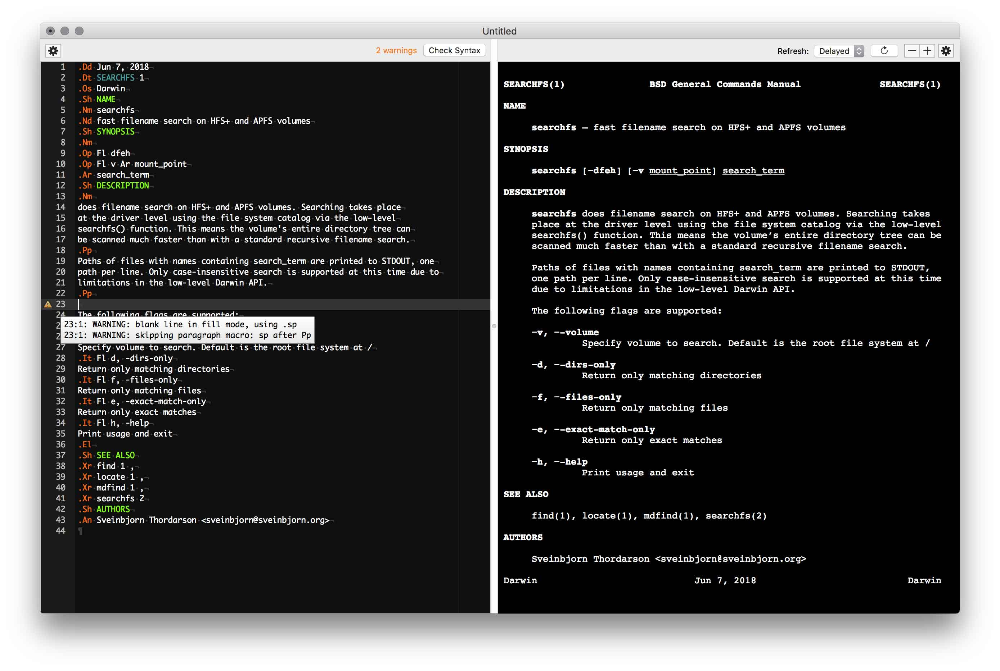

[](https://opensource.org/licenses/BSD-3-Clause)
[]()


# ManDrake

ManDrake is a native <a href="https://en.wikipedia.org/wiki/Man_page">man page</a> editor for macOS with features such as syntax highlighting, live <a href="https://en.wikipedia.org/wiki/Mandoc">`mandoc`</a> syntax validation and a live-updating rendered preview of the man page during editing. It can also export man pages as PDF or HTML.

Long story short, many years ago I was sick of writing man pages in an endless cycle of edit-view, edit-view so I decided to do something about it and created this editor. It's a bit rough around the edges, but it works really well for me. Perhaps it will also be of some use to you.

* [**⇩ Download ManDrake 3.3**](http://sveinbjorn.org/files/software/mandrake/ManDrake-3.3.zip) (~1.9 MB, Intel 64-bit, 10.8 or later)

To learn more about the `mandoc` man page format:

```shell
man mdoc
```

or read [this page](http://www.freebsd.org/cgi/man.cgi?query=mdoc.samples).

[ManDrake](https://sveinbjorn.org/mandrake) is free, open source software distributed under a BSD license. If you find it useful, feel free to [make a donation.](https://sveinbjorn.org/donations)

## Screenshots






## License

Copyright (c) 2004-2022, Sveinbjorn Thordarson <a href="mailto: sveinbjorn@sveinbjorn.org">&lt;sveinbjorn@sveinbjorn.org&gt;</a>

Redistribution and use in source and binary forms, with or without modification,
are permitted provided that the following conditions are met:

1. Redistributions of source code must retain the above copyright notice, this
list of conditions and the following disclaimer.

2. Redistributions in binary form must reproduce the above copyright notice, this
list of conditions and the following disclaimer in the documentation and/or other
materials provided with the distribution.

3. Neither the name of the copyright holder nor the names of its contributors may
be used to endorse or promote products derived from this software without specific
prior written permission.

THIS SOFTWARE IS PROVIDED BY THE COPYRIGHT HOLDERS AND CONTRIBUTORS "AS IS" AND
ANY EXPRESS OR IMPLIED WARRANTIES, INCLUDING, BUT NOT LIMITED TO, THE IMPLIED
WARRANTIES OF MERCHANTABILITY AND FITNESS FOR A PARTICULAR PURPOSE ARE DISCLAIMED.
IN NO EVENT SHALL THE COPYRIGHT HOLDER OR CONTRIBUTORS BE LIABLE FOR ANY DIRECT,
INDIRECT, INCIDENTAL, SPECIAL, EXEMPLARY, OR CONSEQUENTIAL DAMAGES (INCLUDING, BUT
NOT LIMITED TO, PROCUREMENT OF SUBSTITUTE GOODS OR SERVICES; LOSS OF USE, DATA, OR
PROFITS; OR BUSINESS INTERRUPTION) HOWEVER CAUSED AND ON ANY THEORY OF LIABILITY,
WHETHER IN CONTRACT, STRICT LIABILITY, OR TORT (INCLUDING NEGLIGENCE OR OTHERWISE)
ARISING IN ANY WAY OUT OF THE USE OF THIS SOFTWARE, EVEN IF ADVISED OF THE
POSSIBILITY OF SUCH DAMAGE.

## Building ManDrake

### Requirements

If you want to build ManDrake yourself, you need the following components/tools:

* Apple's Xcode
* macOS SDK (10.8 or later)
* Git
* [CocoaPods](https://cocoapods.org)

You may also need to install Xcode’s command line tools with the following command, if you want to re-build the included `cat2html` and `mandoc` binaries 

    xcode-select --install

### Environment Setup

After cloning the repository, run the following commands inside the repository root (i.e. the directory containing this `README.md` file):

    pod install

This installs all the dependencies required. ManDrake can then be built via the `xcworkspace`.

## Captain Mandrake

> **Do I look all rancid and clotted? You look at me, Jack. Eh? Look, eh? And I drink a lot of water, you know. I'm what you might call a water man, Jack - that's what I am. And I can swear to you, my boy, swear to you, that there's nothing wrong with my bodily fluids. Not a thing, Jackie.**

Here's **Group Captain Lionel Mandrake** from Kubrick's wonderful [*Dr. Strangelove or: How I Learned to Stop Worrying and Love the Bomb*](http://www.imdb.com/title/tt0057012/) in the intimidating company of Brigadier General Jack D. Ripper.


